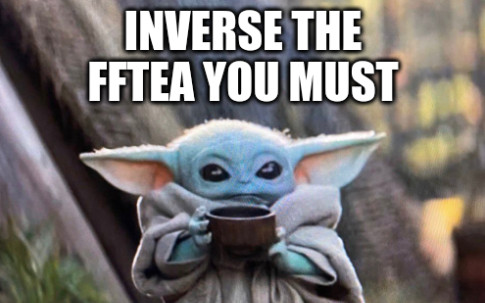

# FCSC 2024 FFTea

La transformée de Fourier permet de représenter un signal temporel dans le domaine fréquentiel : avec cet outil, il est possible de savoir, pour une capture radio, quelles sont les fréquences actives dans la bande de fréquence capturée.

C’est une opération parfaitement réversible : on peut effectuer l’opération inverse sans perte d’information.

Ici, nul besoin de faire une analyse de Fourier: utilisez simplement une transformée de Fourier de taille 64 sur le tableau de données contenu dans le fichier *fftea*, le résultat contient le flag. Le code de génération du fichier est donné.

**Note :** Le format de fichier d’entrée est une suite de nombres complexes sur 64 bits (un nombre flottant sur 32 bits pour la partie réelle et la partie imaginaire). Il est possible de lire le contenu du tableau en Python avec la fonction *fromfile* du paquet *numpy* ainsi: *data = numpy.fromfile("fftea", dtype=numpy.complex64)*.

Fichiers :
- [fftea](fftea)
- [craft_signal.py](craft_signal.py)

Auteur : ElyKar

Origine : [FFTea](https://hackropole.fr/fr/challenges/hardware/fcsc2024-hardware-fftea/)

## Installation manuel
Vous n'utilisez pas l'application **les CTFs de Cyrhades** ? C'est dommage !
Mais voici comment installer ce CTF manuellement :

> git clone https://github.com/Hack-Oeil/fcsc2024-hardware-fftea.git

> cd fcsc2024-hardware-fftea

-----------

## Sur le site officiel hackropole.fr
> https://hackropole.fr/fr/challenges/hardware/fcsc2024-hardware-fftea/